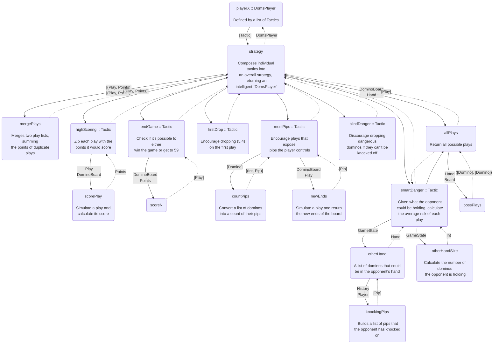
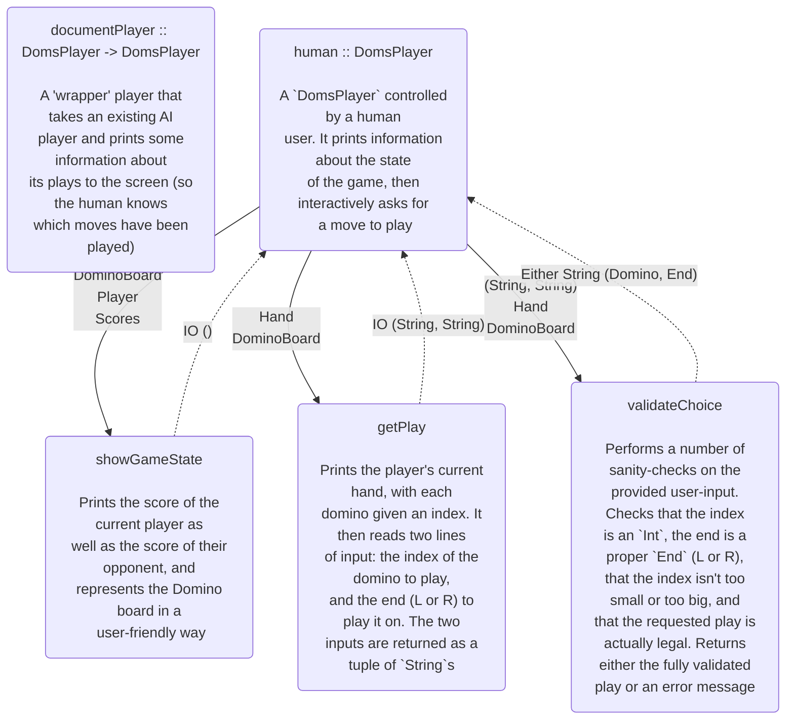

# Dominos
Should I replace `pure` with `return`?

Danger, No Danger
6 & 5; -2 : (5130,4870)
6 & 5; -1 : (5106,4894)
6 & 5; 20 : (47958,52042)
6 & 5; -1 : (50383,49617)
6 & 5; -2 : (50588,49412)
6 & 5; -3 : (50588,49412)
6 & 5; -4 : (50387,49613)
6 & 5; -5 : (50371,49629)
6    ; -2 : (50234,49766)
6,5,4; -2 : (50422,49578)

[![](https://mermaid.ink/img/eyJjb2RlIjoiZmxvd2NoYXJ0IFRCXG4gICAgcGxheWVyWChwbGF5ZXJYIDo6IERvbXNQbGF5ZXJcXG5cXG4gRGVmaW5lZCBieSBhIGxpc3Qgb2YgVGFjdGljcylcbiAgICBwbGF5ZXJYLS0gXCJbVGFjdGljXVwiIC0tPnN0cmF0ZWd5XG4gICAgc3RyYXRlZ3ktLiBEb21zUGxheWVyIC4tPiBwbGF5ZXJYXG4gICAgc3RyYXRlZ3koc3RyYXRlZ3lcXG5cXG4gQ29tcG9zZXMgaW5kaXZpZHVhbCB0YWN0aWNzIGludG9cXG5hbiBvdmVyYWxsIHN0cmF0ZWd5LCByZXR1cm5pbmcgYW5cXG4gaW50ZWxsaWdlbnQgYERvbXNQbGF5ZXJgKVxuICAgIG1lcmdlUGxheXMobWVyZ2VQbGF5c1xcblxcbiBNZXJnZXMgdHdvIHBsYXkgbGlzdHMsIHN1bW1pbmdcXG4gdGhlIHBvaW50cyBvZiBkdXBsaWNhdGUgcGxheXMpXG4gICAgc3RyYXRlZ3ktLSBcIlsoUGxheSwgUG9pbnRzKV1cXG5bKFBsYXksIFBvaW50cyldXCIgLS0-IG1lcmdlUGxheXNcbiAgICBtZXJnZVBsYXlzLS4gXCJbKFBsYXksIFBvaW50cyldXCIgLi0-c3RyYXRlZ3lcbiAgICBhbGxQbGF5cyhhbGxQbGF5c1xcblxcbiBSZXR1cm4gYWxsIHBvc3NpYmxlIHBsYXlzKVxuICAgIHN0cmF0ZWd5LS0gXCJEb21pbm9Cb2FyZFxcbkhhbmRcIiAtLT5hbGxQbGF5c1xuICAgIGFsbFBsYXlzLS4gXCJbUGxheV1cIiAuLT5zdHJhdGVneVxuICAgIHN0cmF0ZWd5IC0tPkhcbiAgICBILS4tPnN0cmF0ZWd5XG4gICAgSChoaWdoU2NvcmluZyA6OiBUYWN0aWNcXG5cXG4gWmlwIGVhY2ggcGxheSB3aXRoIHRoZVxcbiBwb2ludHMgaXQgd291bGQgc2NvcmUpXG4gICAgc2NvcmVQbGF5KHNjb3JlUGxheVxcblxcbiBTaW11bGF0ZSBhIHBsYXkgYW5kXFxuIGNhbGN1bGF0ZSBpdHMgc2NvcmUpXG4gICAgSC0tIFwiUGxheVxcbkRvbWlub0JvYXJkXCIgLS0-c2NvcmVQbGF5XG4gICAgc2NvcmVQbGF5LS4gUG9pbnRzIC4tPkhcbiAgICBzdHJhdGVneSAtLT5GXG4gICAgRi0uLT5zdHJhdGVneVxuICAgIEYoXCJmaXJzdERyb3AgOjogVGFjdGljXFxuXFxuIEVuY291cmFnZSBkcm9wcGluZyAoNSw0KVxcbiBvbiB0aGUgZmlyc3QgcGxheVwiKVxuICAgIHN0cmF0ZWd5IC0tPkVcbiAgICBFLS4tPnN0cmF0ZWd5XG4gICAgRShcImVuZEdhbWUgOjogVGFjdGljXFxuXFxuIENoZWNrIGlmIGl0J3MgcG9zc2libGUgdG8gZWl0aGVyXFxud2luIHRoZSBnYW1lIG9yIGdldCB0byA1OVwiKVxuICAgIHNjb3JlTihzY29yZU4pXG4gICAgRSAtLSBcIkRvbWlub0JvYXJkXFxuUG9pbnRzXCIgLS0-IHNjb3JlTlxuICAgIHNjb3JlTiAtLiBcIltQbGF5XVwiIC4tPkVcbiAgICBzdHJhdGVneSAtLT5CXG4gICAgQi0uLT5zdHJhdGVneVxuICAgIEIoXCJibGluZERhbmdlciA6OiBUYWN0aWNcXG5cXG4gRGlzY291cmFnZSBkcm9wcGluZyBkYW5nZXJvdXNcXG4gZG9taW5vcyBpZiB0aGV5IGNhbid0IGJlIGtub2NrZWQgb2ZmXCIpXG4gICAgc3RyYXRlZ3kgLS0-TVxuICAgIE0tLi0-c3RyYXRlZ3lcbiAgICBNKFwibW9zdFBpcHMgOjogVGFjdGljXFxuXFxuIEVuY291cmFnZSBwbGF5cyB0aGF0IGV4cG9zZVxcbiBwaXBzIHRoZSBwbGF5ZXIgY29udHJvbHNcIilcbiAgICBjb3VudFBpcHMoY291bnRQaXBzXFxuXFxuIENvbnZlcnQgYSBsaXN0IG9mIGRvbWlub3NcXG4gaW50byBhIGNvdW50IG9mIHRoZWlyIHBpcHMpXG4gICAgTS0tIFwiW0RvbWlub11cIiAtLT5jb3VudFBpcHNcbiAgICBjb3VudFBpcHMtLiBcIlsoSW50LCBQaXApXVwiIC4tPk1cbiAgICBuZXdFbmRzKG5ld0VuZHNcXG5cXG4gU2ltdWxhdGUgYSBwbGF5IGFuZCByZXR1cm5cXG4gdGhlIG5ldyBlbmRzIG9mIHRoZSBib2FyZClcbiAgICBNLS0gXCJEb21pbm9Cb2FyZFxcblBsYXlcIiAtLT5uZXdFbmRzXG4gICAgbmV3RW5kcy0uIFwiW1BpcF1cIiAuLT5NXG4gICAgc3RyYXRlZ3kgLS0-U1xuICAgIFMtLi0-c3RyYXRlZ3lcbiAgICBTKFwic21hcnREYW5nZXIgOjogVGFjdGljXFxuXFxuIEdpdmVuIHdoYXQgdGhlIG9wcG9uZW50XFxuIGNvdWxkIGJlIGhvbGRpbmcsIGNhbGN1bGF0ZVxcbiB0aGUgYXZlcmFnZSByaXNrIG9mIGVhY2ggcGxheVwiKVxuICAgIFMtLT5hbGxQbGF5c1xuICAgIGFsbFBsYXlzLS4tPlNcbiAgICBhbGxQbGF5cy0tIFwiSGFuZFxcbkJvYXJkXCIgLS0-cG9zc1BsYXlzKHBvc3NQbGF5cylcbiAgICBwb3NzUGxheXMtLiBcIihbRG9taW5vXSwgW0RvbWlub10pXCIgLi0-YWxsUGxheXNcbiAgICBTLS1HYW1lU3RhdGUtLT5vdGhlckhhbmRcbiAgICBvdGhlckhhbmQtLlwiSGFuZFwiLi0-IFNcbiAgICBvdGhlckhhbmQob3RoZXJIYW5kXFxuXFxuIEEgbGlzdCBvZiBkb21pbm9zIHRoYXQgY291bGRcXG4gYmUgaW4gdGhlIG9wcG9uZW50J3MgaGFuZClcbiAgICBrbm9ja2luZ1BpcHMoa25vY2tpbmdQaXBzXFxuXFxuIEJ1aWxkcyBhIGxpc3Qgb2YgcGlwcyB0aGF0XFxuIHRoZSBvcHBvbmVudCBoYXMga25vY2tlZCBvbilcbiAgICBvdGhlckhhbmQtLUhpc3RvcnlcXG5QbGF5ZXItLT5rbm9ja2luZ1BpcHNcbiAgICBrbm9ja2luZ1BpcHMtLlwiW1BpcF1cIi4tPiBvdGhlckhhbmRcbiAgICBTLS1HYW1lU3RhdGUtLT5vdGhlckhhbmRTaXplXG4gICAgb3RoZXJIYW5kU2l6ZS0uXCJJbnRcIi4tPiBTXG4gICAgb3RoZXJIYW5kU2l6ZShvdGhlckhhbmRTaXplXFxuXFxuIENhbGN1bGF0ZSB0aGUgbnVtYmVyIG9mIGRvbWlub3NcXG4gdGhlIG9wcG9uZW50IGlzIGhvbGRpbmcpXG4iLCJtZXJtYWlkIjp7InRoZW1lIjoiZGVmYXVsdCJ9LCJ1cGRhdGVFZGl0b3IiOmZhbHNlfQ)](https://mermaid-js.github.io/mermaid-live-editor/#/edit/eyJjb2RlIjoiZmxvd2NoYXJ0IFRCXG4gICAgcGxheWVyWChwbGF5ZXJYIDo6IERvbXNQbGF5ZXJcXG5cXG4gRGVmaW5lZCBieSBhIGxpc3Qgb2YgVGFjdGljcylcbiAgICBwbGF5ZXJYLS0gXCJbVGFjdGljXVwiIC0tPnN0cmF0ZWd5XG4gICAgc3RyYXRlZ3ktLiBEb21zUGxheWVyIC4tPiBwbGF5ZXJYXG4gICAgc3RyYXRlZ3koc3RyYXRlZ3lcXG5cXG4gQ29tcG9zZXMgaW5kaXZpZHVhbCB0YWN0aWNzIGludG9cXG5hbiBvdmVyYWxsIHN0cmF0ZWd5LCByZXR1cm5pbmcgYW5cXG4gaW50ZWxsaWdlbnQgYERvbXNQbGF5ZXJgKVxuICAgIG1lcmdlUGxheXMobWVyZ2VQbGF5c1xcblxcbiBNZXJnZXMgdHdvIHBsYXkgbGlzdHMsIHN1bW1pbmdcXG4gdGhlIHBvaW50cyBvZiBkdXBsaWNhdGUgcGxheXMpXG4gICAgc3RyYXRlZ3ktLSBcIlsoUGxheSwgUG9pbnRzKV1cXG5bKFBsYXksIFBvaW50cyldXCIgLS0-IG1lcmdlUGxheXNcbiAgICBtZXJnZVBsYXlzLS4gXCJbKFBsYXksIFBvaW50cyldXCIgLi0-c3RyYXRlZ3lcbiAgICBhbGxQbGF5cyhhbGxQbGF5c1xcblxcbiBSZXR1cm4gYWxsIHBvc3NpYmxlIHBsYXlzKVxuICAgIHN0cmF0ZWd5LS0gXCJEb21pbm9Cb2FyZFxcbkhhbmRcIiAtLT5hbGxQbGF5c1xuICAgIGFsbFBsYXlzLS4gXCJbUGxheV1cIiAuLT5zdHJhdGVneVxuICAgIHN0cmF0ZWd5IC0tPkhcbiAgICBILS4tPnN0cmF0ZWd5XG4gICAgSChoaWdoU2NvcmluZyA6OiBUYWN0aWNcXG5cXG4gWmlwIGVhY2ggcGxheSB3aXRoIHRoZVxcbiBwb2ludHMgaXQgd291bGQgc2NvcmUpXG4gICAgc2NvcmVQbGF5KHNjb3JlUGxheVxcblxcbiBTaW11bGF0ZSBhIHBsYXkgYW5kXFxuIGNhbGN1bGF0ZSBpdHMgc2NvcmUpXG4gICAgSC0tIFwiUGxheVxcbkRvbWlub0JvYXJkXCIgLS0-c2NvcmVQbGF5XG4gICAgc2NvcmVQbGF5LS4gUG9pbnRzIC4tPkhcbiAgICBzdHJhdGVneSAtLT5GXG4gICAgRi0uLT5zdHJhdGVneVxuICAgIEYoXCJmaXJzdERyb3AgOjogVGFjdGljXFxuXFxuIEVuY291cmFnZSBkcm9wcGluZyAoNSw0KVxcbiBvbiB0aGUgZmlyc3QgcGxheVwiKVxuICAgIHN0cmF0ZWd5IC0tPkVcbiAgICBFLS4tPnN0cmF0ZWd5XG4gICAgRShcImVuZEdhbWUgOjogVGFjdGljXFxuXFxuIENoZWNrIGlmIGl0J3MgcG9zc2libGUgdG8gZWl0aGVyXFxud2luIHRoZSBnYW1lIG9yIGdldCB0byA1OVwiKVxuICAgIHNjb3JlTihzY29yZU4pXG4gICAgRSAtLSBcIkRvbWlub0JvYXJkXFxuUG9pbnRzXCIgLS0-IHNjb3JlTlxuICAgIHNjb3JlTiAtLiBcIltQbGF5XVwiIC4tPkVcbiAgICBzdHJhdGVneSAtLT5CXG4gICAgQi0uLT5zdHJhdGVneVxuICAgIEIoXCJibGluZERhbmdlciA6OiBUYWN0aWNcXG5cXG4gRGlzY291cmFnZSBkcm9wcGluZyBkYW5nZXJvdXNcXG4gZG9taW5vcyBpZiB0aGV5IGNhbid0IGJlIGtub2NrZWQgb2ZmXCIpXG4gICAgc3RyYXRlZ3kgLS0-TVxuICAgIE0tLi0-c3RyYXRlZ3lcbiAgICBNKFwibW9zdFBpcHMgOjogVGFjdGljXFxuXFxuIEVuY291cmFnZSBwbGF5cyB0aGF0IGV4cG9zZVxcbiBwaXBzIHRoZSBwbGF5ZXIgY29udHJvbHNcIilcbiAgICBjb3VudFBpcHMoY291bnRQaXBzXFxuXFxuIENvbnZlcnQgYSBsaXN0IG9mIGRvbWlub3NcXG4gaW50byBhIGNvdW50IG9mIHRoZWlyIHBpcHMpXG4gICAgTS0tIFwiW0RvbWlub11cIiAtLT5jb3VudFBpcHNcbiAgICBjb3VudFBpcHMtLiBcIlsoSW50LCBQaXApXVwiIC4tPk1cbiAgICBuZXdFbmRzKG5ld0VuZHNcXG5cXG4gU2ltdWxhdGUgYSBwbGF5IGFuZCByZXR1cm5cXG4gdGhlIG5ldyBlbmRzIG9mIHRoZSBib2FyZClcbiAgICBNLS0gXCJEb21pbm9Cb2FyZFxcblBsYXlcIiAtLT5uZXdFbmRzXG4gICAgbmV3RW5kcy0uIFwiW1BpcF1cIiAuLT5NXG4gICAgc3RyYXRlZ3kgLS0-U1xuICAgIFMtLi0-c3RyYXRlZ3lcbiAgICBTKFwic21hcnREYW5nZXIgOjogVGFjdGljXFxuXFxuIEdpdmVuIHdoYXQgdGhlIG9wcG9uZW50XFxuIGNvdWxkIGJlIGhvbGRpbmcsIGNhbGN1bGF0ZVxcbiB0aGUgYXZlcmFnZSByaXNrIG9mIGVhY2ggcGxheVwiKVxuICAgIFMtLT5hbGxQbGF5c1xuICAgIGFsbFBsYXlzLS4tPlNcbiAgICBhbGxQbGF5cy0tIFwiSGFuZFxcbkJvYXJkXCIgLS0-cG9zc1BsYXlzKHBvc3NQbGF5cylcbiAgICBwb3NzUGxheXMtLiBcIihbRG9taW5vXSwgW0RvbWlub10pXCIgLi0-YWxsUGxheXNcbiAgICBTLS1HYW1lU3RhdGUtLT5vdGhlckhhbmRcbiAgICBvdGhlckhhbmQtLlwiSGFuZFwiLi0-IFNcbiAgICBvdGhlckhhbmQob3RoZXJIYW5kXFxuXFxuIEEgbGlzdCBvZiBkb21pbm9zIHRoYXQgY291bGRcXG4gYmUgaW4gdGhlIG9wcG9uZW50J3MgaGFuZClcbiAgICBrbm9ja2luZ1BpcHMoa25vY2tpbmdQaXBzXFxuXFxuIEJ1aWxkcyBhIGxpc3Qgb2YgcGlwcyB0aGF0XFxuIHRoZSBvcHBvbmVudCBoYXMga25vY2tlZCBvbilcbiAgICBvdGhlckhhbmQtLUhpc3RvcnlcXG5QbGF5ZXItLT5rbm9ja2luZ1BpcHNcbiAgICBrbm9ja2luZ1BpcHMtLlwiW1BpcF1cIi4tPiBvdGhlckhhbmRcbiAgICBTLS1HYW1lU3RhdGUtLT5vdGhlckhhbmRTaXplXG4gICAgb3RoZXJIYW5kU2l6ZS0uXCJJbnRcIi4tPiBTXG4gICAgb3RoZXJIYW5kU2l6ZShvdGhlckhhbmRTaXplXFxuXFxuIENhbGN1bGF0ZSB0aGUgbnVtYmVyIG9mIGRvbWlub3NcXG4gdGhlIG9wcG9uZW50IGlzIGhvbGRpbmcpXG4iLCJtZXJtYWlkIjp7InRoZW1lIjoiZGVmYXVsdCJ9LCJ1cGRhdGVFZGl0b3IiOmZhbHNlfQ)

```hs
*Main AI DomsMatch Game Control.Parallel.Strategies> foldr1 (\(a,b) (x,y) -> (a+x, b+y)) $ parMap rdeepseq (domsMatch playerHFE playerHFEBM 6250) [1..16]
(48173,51827)
*Main AI DomsMatch Game Control.Parallel.Strategies> foldr1 (\(a,b) (x,y) -> (a+x, b+y)) $ parMap rdeepseq (domsMatch playerHFEBM playerHFE 6250) [1..16]
(51683,48317)

*Main AI DomsMatch Game Control.Parallel.Strategies> foldr1 (\(a,b) (x,y) -> (a+x, b+y)) $ parMap rdeepseq (domsMatch playerHFEB playerHFE 6250) [1..16]
(50588,49412)
*Main AI DomsMatch Game Control.Parallel.Strategies> foldr1 (\(a,b) (x,y) -> (a+x, b+y)) $ parMap rdeepseq (domsMatch playerHFE playerHFEB 6250) [1..16]
(49340,50660)

*Main AI DomsMatch Game Control.Parallel.Strategies> foldr1 (\(a,b) (x,y) -> (a+x, b+y)) $ parMap rdeepseq (domsMatch playerHFEBM playerHFEB 6250) [1..16]
(51059,48941)
*Main AI DomsMatch Game Control.Parallel.Strategies> foldr1 (\(a,b) (x,y) -> (a+x, b+y)) $ parMap rdeepseq (domsMatch playerHFEB playerHFEBM 6250) [1..16]
(48839,51161)
```



